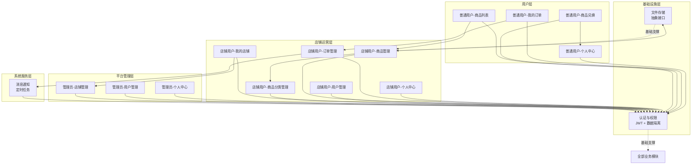

# 多店铺积分商城系统 - 系统架构文档

## 1. 基础技术框架

本系统基于现有项目结构，采用前后端分离架构。后端使用 Spring Boot + MyBatis，前端使用 Vue 3 + TypeScript，通过多租户数据隔离实现店铺级数据安全。

### 1.1 技术栈选择

#### 后端技术框架

- **框架**：Spring Boot 4.0.6
- **语言**：Java 21
- **ORM**：MyBatis 4.0.1
- **构建工具**：Maven
- **测试框架**：JUnit 5

#### 前端技术框架

- **框架**：Vue 3 (Composition API + `<script setup>`) + TypeScript
- **UI组件库**：reka-ui
- **状态管理**：Pinia
- **路由**：Vue Router 4
- **样式**：UnoCSS + 液态玻璃（Glassmorphism）
- **包管理器**：pnpm

#### 数据库选择

- **主数据库**：MySQL 8.0+
- **字符集**：utf8mb4
- **排序规则**：utf8mb4_general_ci

#### 中间件和基础设施

| 组件 | 推荐技术 | 用途 | 可选性 |
|------|----------|------|--------|
| 数据隔离 | MyBatis拦截器 + ThreadLocal | shop_id 自动注入，多租户隔离 | 必选 |
| 认证 | JWT Token | 无状态认证，支持多店铺场景 | 必选 |
| 文件存储 | 抽象存储接口 + 本地实现 | 商品图片、店铺Logo存储，预留OSS扩展 | 必选 |
| 定时任务 | Spring @Scheduled | 订单超时提醒（7天未确认） | 必选 |
| Excel导入 | EasyExcel | 批量用户导入 | 可选 |
| HTTP客户端 | Axios | 前端HTTP请求封装 | 必选 |

#### 新增技术选型理由

基于 PRD 需求分析，新增以下技术组件：

- **JWT Token**：多店铺场景下无状态认证最适合，无需 Session 存储，适合水平扩展
- **MyBatis拦截器 + ThreadLocal**：实现表级别数据隔离（shop_id），业务代码无感知
- **抽象存储接口**：文件存储实现与业务逻辑分离，预留未来切换到 OSS 的扩展能力
- **Spring @Scheduled**：轻量级定时任务，满足订单超时提醒需求，无需引入 XXL-JOB 等重量级框架

---

## 2. 模块划分和模块间依赖关系

### 2.1 系统模块分层架构

```
Controller层（控制器层）
    ↓
Service层（业务逻辑层）
    ↓
DAO层（数据访问层：MyBatis Mapper）
```

**分层职责**：

- **Controller层**：接收HTTP请求，参数校验，调用Service层，返回统一响应格式
- **Service层**：业务逻辑处理，事务管理，调用DAO层
- **DAO层**：数据库操作，SQL编写，与数据库交互

### 2.2 业务模块划分

| 模块 | 职责范围 | 对应功能 | 依赖关系 |
|------|----------|----------|----------|
| **基础设施-认证与权限** | 登录注册、JWT Token、用户权限、数据隔离 | 全部业务模块 | 无 |
| **基础设施-文件存储** | 文件上传、下载、存储抽象 | 商品管理、店铺管理 | 无 |
| **系统-消息通知** | 站内消息发送/查看、定时任务 | 订单超时提醒 | 认证与权限 |
| **管理员-店铺管理** | 店铺审核、冻结/解冻、列表查看 | 平台层功能 | 认证与权限 |
| **管理员-用户管理** | 跨店铺用户管理、密码重置 | 平台层功能 | 认证与权限 |
| **管理员-个人中心** | 管理员信息管理、邀请码 | 平台层功能 | 认证与权限 |
| **店铺用户-我的店铺** | 店铺申请、状态、邀请码 | 店铺层功能 | 认证与权限、店铺管理 |
| **店铺用户-商品分类管理** | 商品分类CRUD | 店铺层功能 | 认证与权限 |
| **店铺用户-商品管理** | 商品CRUD、上架下架 | 店铺层功能 | 认证与权限、分类管理、文件存储 |
| **店铺用户-用户管理** | 普通用户管理、积分维护 | 店铺层功能 | 认证与权限 |
| **店铺用户-订单管理** | 订单处理、发货、完成、关闭 | 店铺层功能 | 认证与权限、消息通知 |
| **店铺用户-个人中心** | 店铺用户信息管理 | 店铺层功能 | 认证与权限 |
| **普通用户-商品列表** | 商品浏览、搜索、筛选 | 用户层功能 | 认证与权限、商品管理 |
| **普通用户-商品兑换** | 积分兑换、收货信息 | 用户层功能 | 认证与权限、地址簿、订单创建 |
| **普通用户-我的订单** | 订单查看、关闭 | 用户层功能 | 认证与权限、订单管理 |
| **普通用户-个人中心** | 信息管理、积分、地址簿 | 用户层功能 | 认证与权限 |

### 2.3 模块间依赖关系图



**依赖关系说明**：

- **认证与权限**为基础模块，所有业务模块依赖它实现身份认证和数据隔离
- **文件存储**为基础模块，商品管理和店铺管理模块依赖它实现图片上传
- **消息通知**依赖认证与权限，被订单管理触发（订单超时提醒）
- 店铺用户模块依赖管理员的店铺审核结果（店铺状态影响功能可用性）
- 普通用户模块依赖店铺用户的商品和订单数据

### 2.4 模块间通信方式

| 场景 | 通信方式 | 说明 |
|------|----------|------|
| 前端调用后端API | HTTP RESTful | 统一响应格式 `{success, code, message, data}` |
| 业务逻辑处理 | 方法调用 | Service层直接调用DAO层 |
| 数据隔离 | MyBatis拦截器 | 自动注入shop_id，无需业务代码感知 |
| 消息通知 | Spring事件/定时任务 | 订单超时通过@Scheduled轮询 |
| 文件上传 | 抽象存储接口 | StorageService接口，本地实现LocalStorageService |

---

## 3. 本系统与外部系统的关联

### 3.1 本系统调用外部系统的接口（集成外部服务）

本系统为内部电商系统，**不调用外部系统接口**。所有功能均为自研，包括：

- 无第三方登录集成
- 无第三方支付集成
- 无物流查询接口
- 文件存储使用本地文件系统（预留OSS扩展）

### 3.2 本系统提供给外部的接口（对外暴露服务接口）

本系统为内部系统，**不提供对外接口**。

### 3.3 接口清单

| 外部系统 | 交互方式 | 集成方式 | 错误处理 |
|----------|----------|----------|----------|
| 无 | - | - | - |

---

## 4. 架构约束

### 4.1 性能要求

#### 响应时间要求

| 场景 | 目标响应时间 | 说明 |
|------|-------------|------|
| 页面加载 | < 2s | 首屏加载时间 |
| API调用 | < 500ms | 正常业务操作 |
| 文件上传 | < 5s | 图片上传（≤ 2MB） |

#### 并发量要求

| 场景 | 目标并发量 | 说明 |
|------|-------------|------|
| 同时在线用户 | 100-500 | 中小规模店铺使用 |
| API并发 | 50-100 TPS | 普通操作 |

#### 数据量要求

| 场景 | 预估数据量 | 说明 |
|------|-----------|------|
| 单店铺用户数 | 1万以内 | 普通店铺规模 |
| 单店铺商品数 | 1万以内 | 商品数量限制 |
| 单店铺订单数 | 10万以内 | 订单历史累积 |

### 4.2 安全要求

#### 认证方式

- **方式**：JWT Token
- **实现**：jjwt库（HMAC-SHA256签名）
- **Token有效期**：7天（可配置）
- **登录方式**：用户名+密码，返回Token

#### 授权机制

- **方式**：基于角色（RBAC-like）
- **实现**：JWT Claims中存储角色和shop_id
- **权限粒度**：模块级（管理员/店铺用户/普通用户）

#### 数据加密

- **传输加密**：HTTPS（TLS 1.2+）
- **存储加密**：数据库密码加密存储
- **密码加密**：BCrypt加密

#### 敏感数据保护

- **字段脱敏**：手机号中间四位脱敏
- **访问审计**：关键操作记录日志
- **数据隔离**：shop_id级别，表级别多租户隔离

### 4.3 可扩展性要求

当前架构满足中等规模（10万用户以内）的业务需求。如需扩展：

- **应用部署**：可水平扩展部署多个实例，JWT无状态支持
- **数据库扩展**：当前为单机MySQL，满足当前需求

### 4.4 技术约束

#### 必须使用的技术栈

- **后端框架**：Spring Boot 4.0.6
- **前端框架**：Vue 3 + TypeScript
- **数据库**：MySQL 8.0+
- **ORM**：MyBatis 4.0.1
- **UI组件库**：reka-ui
- **状态管理**：Pinia
- **缓存**：可选（Redis）
- **包管理器**：pnpm

#### 禁止的技术

- **禁止物理删除**：所有数据使用逻辑删除（deleted字段）
- **禁止自增主键**：必须使用雪花ID（Long类型）
- **禁止物理外键**：表间关联通过应用层逻辑维护

#### 兼容性要求

- **浏览器**：Chrome/Firefox/Safari/Edge 最新两个版本
- **移动端**：暂不支持移动端H5（后续可扩展）

---

## 5. 附录

### 5.1 技术术语表

| 术语 | 说明 |
|------|------|
| 雪花ID | 分布式ID算法，确保ID唯一性和趋势递增 |
| 逻辑删除 | 通过deleted字段标记删除，不物理删除数据 |
| 表级别隔离 | 多租户数据隔离方案，通过shop_id字段区分数据归属 |
| 液态玻璃 | Glassmorphism设计风格，背景模糊+半透明+光泽边框 |
| JWT | JSON Web Token，无状态身份认证令牌 |

### 5.2 参考文档

- [PRD文档](/context/02_prd/PRD.md)
- [后端开发指南](/code/backend/AGENTS.md)
- [前端开发指南](/code/frontend/AGENTS.md)
- [液态玻璃设计资产](/UI/00_UI页面提示词.md)

### 5.3 变更记录

| 版本 | 日期 | 变更内容 | 作者 |
|------|------|---------|------|
| v1.0 | 2026-04-28 | 初始架构设计 | Sisyphus |

---

**文档版本**：v1.0
**创建日期**：2026-04-28
**最后更新**：2026-04-28