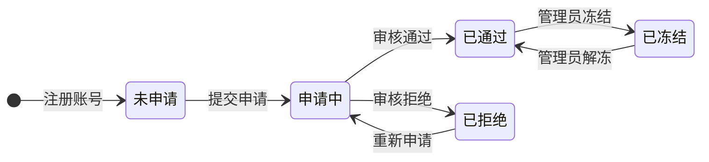
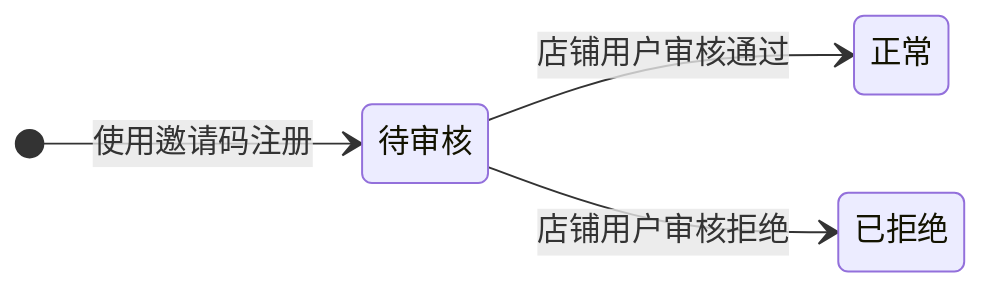

# 我的店铺 功能需求规格说明书

## 文档信息

- 基线 Feature：无
- 变更组：无

---

# 功能需求规格说明书

## 1. 概述

### 1.1 功能背景

新注册的店铺用户没有店铺，需要通过「我的店铺」功能提交店铺申请，上传店铺Logo、填写店铺名称、描述和申请理由。申请提交后由管理员进行审核，审核通过后才能对商品和用户进行管理。当店铺被管理员冻结时，所有商品自动下架，但已下单用户的订单会继续正常流转。

店铺用户可通过「我的店铺」生成邀请码，用于邀请普通用户注册。**通过邀请码注册的普通用户账号默认为「待审核」状态，待审核用户不能登录系统，必须由店铺用户审核通过后才能登录使用。**

### 1.2 本功能业务目标

1. 为店铺用户提供便捷的店铺申请入口，清晰展示申请状态
2. 支持店铺被拒绝后的重新申请，复用原有店铺信息
3. 明确店铺冻结规则，保证已下单用户权益不受影响
4. 提供邀请码管理功能，便于店铺用户邀请普通用户注册
5. **通过邀请码注册的普通用户默认为「待审核」状态，需店铺用户审核后才能登录**

---

## 2. 角色与权限矩阵

### 2.1 数据权限（行级访问控制）

| 角色 | 数据范围 | 说明 |
|------|---------|------|
| 店铺用户 | 仅本店数据 | 只能查看和操作自己店铺的申请记录和店铺信息 |
| 管理员 | 全部数据 | 可查看所有店铺申请，可执行审核/冻结/解冻操作 |

**数据范围说明：**
- **仅本店**：通过 `shop_id` 过滤，只能访问自己店铺的数据
- **全部数据**：无过滤条件，可访问所有店铺数据

### 2.2 页面访问权限

| 页面名称 | 可访问角色 | 可操作角色 | 字段级权限（如有） |
|---------|----------|----------|------------------|
| 我的店铺 | 店铺用户 | 店铺用户 | 店铺状态为「已冻结」时，部分操作按钮禁用 |
| 申请店铺弹窗 | 店铺用户 | 店铺用户 | 店铺状态为「申请中」或「已通过」时不可申请 |
| 重新申请弹窗 | 店铺用户 | 店铺用户 | 仅「已拒绝」状态可用 |
| 管理员-店铺管理 | 管理员 | 管理员 | 可执行审核、冻结、解冻操作 |

**权限说明：**
- **店铺用户**：「我的店铺」页面无店铺状态限制，始终可访问
- **管理员**：通过「管理员-店铺管理」功能间接管理本功能的店铺状态

---

## 3. 页面与功能总览

### 3.1 页面清单

| 序号 | 页面名称 | 页面形式 | 职责说明 | 包含功能 |
|-----|---------|---------|---------|---------|
| 1 | 我的店铺 | 独立页面 | 展示店铺信息和审核状态，提供申请/重新申请入口 | 查看店铺状态、申请店铺、重新申请、查看拒绝理由+历史、邀请码管理 |
| 2 | 申请店铺弹窗 | 弹窗对话框 | 填写店铺申请信息并提交 | 上传Logo、填写店铺信息、提交申请 |
| 3 | 重新申请弹窗 | 弹窗对话框 | 自动带入当前店铺信息，填写新申请理由 | 编辑店铺信息、填写申请理由、提交申请 |
| 4 | 拒绝理由查看弹窗 | 弹窗对话框 | 展示拒绝原因和历史拒绝记录 | 查看当前拒绝理由、查看历史拒绝记录 |

### 3.2 页面跳转流程

```
[我的店铺页面]
       │
       ├── 点击"申请店铺" → [申请店铺弹窗]
       │                          │
       │                     填写信息 → 提交 → 返回[我的店铺]
       │
       ├── 点击"重新申请" → [重新申请弹窗]
       │                          │
       │              （自动带入原店铺信息）   │
       │                     修改信息 → 填写申请理由 → 提交 → 返回[我的店铺]
       │
       ├── 点击"查看拒绝理由" → [拒绝理由查看弹窗]
       │                          │
       │                     查看原因+历史 → 关闭
       │
       └── 点击"生成邀请码" → [系统处理]
```

**流程说明：**
1. 店铺用户进入「我的店铺」页面，根据店铺状态显示不同内容
2. 未申请店铺时，点击「申请店铺」打开申请表单
3. 店铺被拒绝后，点击「重新申请」可编辑原有信息并填写新申请理由
4. 被拒绝时点击「查看拒绝理由」可查看当前拒绝原因和历史记录
5. 店铺正常运营时可生成/重生成邀请码用于普通用户注册

---

## 4. 页面功能详细说明

### 按钮级别说明（通用）

| 级别 | 位置 | 作用域 | 示例 |
|-----|-----|-------|------|
| **页面级按钮** | 页面顶部工具栏 | 针对整个页面或全局操作 | 申请店铺、生成邀请码 |
| **行级按钮** | 列表的操作列 | 针对单条数据记录 | 查看详情、重新申请 |
| **字段级按钮** | 字段右侧或内部 | 针对单个字段的辅助操作 | 上传Logo、清除 |

---

### 4.1 页面 1：我的店铺

#### 4.1.1 页面概述

**页面形式：**独立页面

**页面职责：**展示当前店铺的申请状态和基本信息，提供申请/重新申请入口，管理邀请码。店铺用户进入系统后看到的第一个与店铺相关的页面。

#### 4.1.2 涉及字段

##### A. 店铺状态展示

| 字段名称 | 字段类型 | 数据来源 | 获取时机 | 校验规则 | 默认值 | 业务含义 |
|---------|---------|---------|---------|---------|--------|--------|
| 店铺Logo | 图片 | 数据库查询 | 页面加载 | 无 | 默认占位图 | 店铺标识 |
| 店铺名称 | 文本 | 数据库查询 | 页面加载 | 只读 | 无 | 店铺名称 |
| 店铺描述 | 文本 | 数据库查询 | 页面加载 | 只读 | 无 | 店铺简介 |
| 审核状态 | 标签 | 数据库查询 | 页面加载 | 无 | 无 | 申请状态标识 |
| 申请时间 | 日期时间 | 数据库查询 | 页面加载 | 无 | 无 | 最近一次申请提交时间 |
| 拒绝理由 | 文本 | 数据库查询 | 页面加载 | 只读 | 无 | 被拒绝的原因 |
| 邀请码 | 文本 | 数据库查询 | 页面加载 | 只读 | 无 | 用于普通用户注册的邀请码 |

##### B. 拒绝历史记录

| 字段名称 | 字段类型 | 数据来源 | 获取时机 | 校验规则 | 默认值 | 业务含义 |
|---------|---------|---------|---------|---------|--------|--------|
| 申请时间 | 日期时间 | 数据库查询 | 点击查看时 | 无 | 无 | 历史申请提交时间 |
| 拒绝理由 | 文本 | 数据库查询 | 点击查看时 | 只读 | 无 | 该次申请被拒绝的原因 |
| 申请状态 | 标签 | 数据库查询 | 点击查看时 | 无 | 无 | 已拒绝 |

#### 4.1.3 功能与按钮

**用户可操作功能：**

- **申请店铺**
  - 触发按钮：「申请店铺」
  - 按钮级别：页面级
  - 按钮位置：页面状态为「未申请」时显示
  - 触发方式：点击按钮
  - 权限要求：店铺用户（店铺状态为「未申请」时可见）
  - 加载状态：点击后显示loading，提交后消失
  - 功能说明：点击后打开「申请店铺弹窗」，用户填写店铺信息后提交申请

- **重新申请**
  - 触发按钮：「重新申请」
  - 按钮级别：页面级
  - 按钮位置：页面状态为「已拒绝」时显示
  - 触发方式：点击按钮
  - 权限要求：店铺用户（店铺状态为「已拒绝」时可见）
  - 加载状态：点击后显示loading，提交后消失
  - 功能说明：点击后打开「重新申请弹窗」，自动带入当前店铺的Logo、名称、描述，填写新申请理由后提交

- **查看拒绝理由**
  - 触发按钮：「查看拒绝理由」
  - 按钮级别：页面级
  - 按钮位置：页面状态为「已拒绝」时显示
  - 触发方式：点击按钮
  - 权限要求：店铺用户（店铺状态为「已拒绝」时可见）
  - 加载状态：点击后显示loading，数据加载后消失
  - 功能说明：点击后打开「拒绝理由查看弹窗」，展示当前拒绝原因和历史拒绝记录

- **生成/重生成邀请码**
  - 触发按钮：「生成邀请码」/「重新生成」
  - 按钮级别：页面级
  - 按钮位置：页面邀请码区域
  - 触发方式：点击按钮
  - 权限要求：店铺用户（店铺状态为「已通过」或「已冻结」时可用）
  - 加载状态：点击后显示loading
  - 功能说明：生成新的邀请码，新码生成后旧码立即失效（已在注册/审核中的账号继续可用）

- **复制邀请码**
  - 触发按钮：「复制」图标/按钮
  - 按钮级别：字段级
  - 按钮位置：邀请码输入框右侧
  - 触发方式：点击按钮
  - 权限要求：店铺用户（店铺状态为「已通过」或「已冻结」时可用）
  - 加载状态：无
  - 功能说明：点击后将当前显示的邀请码复制到剪贴板，提示「邀请码已复制」

**后台自动流程：**

- **状态刷新**
  - 触发时机：页面加载时
  - 说明：页面加载时自动查询当前店铺状态，根据状态显示不同内容

#### 4.1.4 业务规则

- **规则1：申请状态限制**
  - 规则描述：店铺状态为「申请中」或「已通过」时，不可申请店铺
  - 触发条件：店铺状态为「申请中」或「已通过」
  - 约束说明：「申请店铺」按钮不显示

- **规则2：冻结后商品自动下架**
  - 规则描述：当管理员将店铺状态改为「已冻结」时，该店铺的所有上架商品自动变为下架状态
  - 触发条件：管理员执行冻结操作
  - 约束说明：下架操作由系统自动执行，无需人工干预

- **规则3：冻结后订单正常流转**
  - 规则描述：店铺被冻结后，已存在的订单继续正常流转（店铺用户仍可确认订单、发货等），不受冻结影响
  - 触发条件：店铺状态变为「已冻结」
  - 约束说明：冻结仅影响商品管理和用户管理功能，不影响订单处理

- **规则4：解冻后商品保持下架**
  - 规则描述：店铺解冻后，之前因冻结自动下架的商品保持下架状态，需要店铺用户手动重新上架
  - 触发条件：管理员执行解冻操作
  - 约束说明：解冻不会自动恢复商品上架状态

- **规则5：邀请码唯一性**
  - 规则描述：每个店铺同时只能有一个有效的邀请码，新码生成后旧码立即失效
  - 触发条件：点击「重新生成」按钮
  - 约束说明：已在注册或审核中的普通用户账号仍可使用旧码完成注册流程

- **规则6：邀请码注册用户默认待审核**
  - 规则描述：通过邀请码注册成功的普通用户，账号状态默认为「待审核」，**该状态用户不能登录系统**
  - 触发条件：普通用户使用邀请码完成注册
  - 约束说明：必须由店铺用户在「店铺用户-用户管理」中审核通过后，用户才能登录

- **规则7：待审核用户登录限制**
  - 规则描述：账号状态为「待审核」的普通用户，登录时提示「账号待审核，请联系店铺管理员审核」
  - 触发条件：待审核用户尝试登录
  - 约束说明：登录接口校验账号状态，待审核用户不允许登录

#### 4.1.5 交互逻辑

- **空状态提示**：当店铺状态为「未申请」时，页面中央显示「暂无店铺，点击下方按钮申请」引导文案
- **状态标签**：不同状态显示不同颜色的标签（申请中：蓝色、已通过：绿色、已拒绝：红色、已冻结：灰色）
- **重新申请表单预填**：重新申请弹窗打开时自动回填当前店铺的Logo、名称、描述
- **邀请码复制**：点击复制按钮后显示Toast提示「邀请码已复制」，3秒后消失
- **邀请码展示**：显示当前有效邀请码，若未生成则显示「点击生成」占位文字

#### 4.1.6 权限要求

> 参见第2.2节"页面访问权限"，本页面的可访问角色、可操作角色以第2章定义为准。

---

### 4.2 页面 2：申请店铺弹窗

#### 4.2.1 页面概述

**页面形式：**弹窗对话框

**页面职责：**收集并提交店铺申请信息，包括Logo、名称、描述和申请理由。

#### 4.2.2 涉及字段

| 字段名称 | 字段类型 | 数据来源 | 获取时机 | 校验规则 | 默认值 | 业务含义 |
|---------|---------|---------|---------|---------|--------|--------|
| 店铺Logo | 文件上传 | 用户上传 | 用户选择 | 必填、图片格式(jpg/png/webp)、大小≤5MB | 无 | 店铺标识图片 |
| 店铺名称 | 文本 | 用户输入 | 用户输入 | 必填、2-50字符、不允许特殊字符 | 无 | 店铺名称 |
| 店铺描述 | 文本 | 用户输入 | 用户输入 | 非必填、0-500字符 | 无 | 店铺简介 |
| 申请理由 | 文本 | 用户输入 | 用户输入 | 必填、10-500字符 | 无 | 申请原因说明 |

#### 4.2.3 功能与按钮

**用户可操作功能：**

- **提交申请**
  - 触发按钮：「提交申请」
  - 按钮级别：页面级（弹窗底部）
  - 按钮位置：弹窗底部右侧
  - 触发方式：点击按钮
  - 权限要求：店铺用户
  - 加载状态：点击后显示loading，提交成功后关闭弹窗
  - 功能说明：校验所有必填字段通过后，提交申请数据到后端，店铺状态变更为「申请中」

- **取消**
  - 触发按钮：「取消」
  - 按钮级别：页面级（弹窗底部）
  - 按钮位置：弹窗底部左侧
  - 触发方式：点击按钮
  - 权限要求：店铺用户
  - 加载状态：无
  - 功能说明：关闭弹窗，不提交任何数据

#### 4.2.4 业务规则

- **规则1：Logo上传校验**
  - 规则描述：仅支持jpg、png、webp格式图片，文件大小不超过5MB
  - 触发条件：用户选择文件上传时
  - 约束说明：格式或大小不符合时提示错误，不提交

- **规则2：名称唯一性**
  - 规则描述：店铺名称在平台内必须唯一，不允许重复
  - 触发条件：提交申请时
  - 约束说明：名称重复时提示错误，阻止提交

#### 4.2.5 交互逻辑

- **实时校验**：字段失焦时进行校验，显示错误提示
- **图片预览**：上传后立即显示预览，支持删除和替换
- **必填标识**：必填字段前显示红色星号
- **字数统计**：店铺名称和申请理由显示实时字数统计

#### 4.2.6 权限要求

> 参见第2.2节"页面访问权限"，本页面的可访问角色、可操作角色以第2章定义为准。

---

### 4.3 页面 3：重新申请弹窗

#### 4.3.1 页面概述

**页面形式：**弹窗对话框

**页面职责：**自动带入当前店铺信息，用户可修改后填写新申请理由重新提交。

#### 4.3.2 涉及字段

| 字段名称 | 字段类型 | 数据来源 | 获取时机 | 校验规则 | 默认值 | 业务含义 |
|---------|---------|---------|---------|---------|--------|--------|
| 店铺Logo | 文件上传 | 数据库查询（预填） | 弹窗打开时 | 必填、图片格式(jpg/png/webp)、大小≤5MB | 当前店铺Logo | 店铺标识图片（可修改） |
| 店铺名称 | 文本 | 数据库查询（预填） | 弹窗打开时 | 必填、2-50字符、不允许特殊字符 | 当前店铺名称 | 店铺名称（可修改） |
| 店铺描述 | 文本 | 数据库查询（预填） | 弹窗打开时 | 非必填、0-500字符 | 当前店铺描述 | 店铺简介（可修改） |
| 申请理由 | 文本 | 用户输入 | 用户输入 | 必填、10-500字符 | 无 | 新的申请原因说明 |

#### 4.3.3 功能与按钮

**用户可操作功能：**

- **提交申请**
  - 触发按钮：「提交申请」
  - 按钮级别：页面级（弹窗底部）
  - 按钮位置：弹窗底部右侧
  - 触发方式：点击按钮
  - 权限要求：店铺用户（店铺状态为「已拒绝」时可用）
  - 加载状态：点击后显示loading，提交成功后关闭弹窗
  - 功能说明：校验所有必填字段通过后，提交重新申请数据，店铺状态变更为「申请中」

- **取消**
  - 触发按钮：「取消」
  - 按钮级别：页面级（弹窗底部）
  - 按钮位置：弹窗底部左侧
  - 触发方式：点击按钮
  - 权限要求：店铺用户
  - 加载状态：无
  - 功能说明：关闭弹窗，不提交任何数据

#### 4.3.4 业务规则

- **规则1：复用原Logo**
  - 规则描述：重新申请时Logo默认预填当前店铺Logo，用户可选择保留或重新上传
  - 触发条件：打开重新申请弹窗时
  - 约束说明：预填的Logo作为默认值，用户可替换

- **规则2：名称唯一性（更新时）**
  - 规则描述：修改店铺名称时仍需保证名称唯一
  - 触发条件：修改名称并提交时
  - 约束说明：名称重复时提示错误，阻止提交

#### 4.3.5 交互逻辑

- **自动预填**：弹窗打开时自动回填当前店铺的Logo、名称、描述
- **修改提示**：用户修改字段时实时显示修改状态
- **其他交互**：参见「申请店铺弹窗」的交互逻辑

#### 4.3.6 权限要求

> 参见第2.2节"页面访问权限"，本页面的可访问角色、可操作角色以第2章定义为准。

---

### 4.4 页面 4：拒绝理由查看弹窗

#### 4.4.1 页面概述

**页面形式：**弹窗对话框

**页面职责：**展示当前拒绝原因和历史的拒绝记录。

#### 4.4.2 涉及字段

##### A. 当前拒绝信息

| 字段名称 | 字段类型 | 数据来源 | 获取时机 | 校验规则 | 默认值 | 业务含义 |
|---------|---------|---------|---------|---------|--------|--------|
| 当前拒绝理由 | 文本 | 数据库查询 | 弹窗打开时 | 只读 | 无 | 最近一次被拒绝的原因 |
| 拒绝时间 | 日期时间 | 数据库查询 | 弹窗打开时 | 只读 | 无 | 最近一次拒绝的时间 |

##### B. 历史拒绝记录

| 字段名称 | 字段类型 | 数据来源 | 获取时机 | 校验规则 | 默认值 | 业务含义 |
|---------|---------|---------|---------|---------|--------|--------|
| 申请时间 | 日期时间 | 数据库查询 | 弹窗打开时 | 只读 | 无 | 历史申请的提交时间 |
| 拒绝理由 | 文本 | 数据库查询 | 弹窗打开时 | 只读 | 无 | 历史申请被拒绝的原因 |
| 申请状态 | 标签 | 数据库查询 | 弹窗打开时 | 只读 | 无 | 显示「已拒绝」标签 |

#### 4.4.3 功能与按钮

**用户可操作功能：**

- **关闭**
  - 触发按钮：「关闭」
  - 按钮级别：页面级（弹窗底部）
  - 按钮位置：弹窗底部
  - 触发方式：点击按钮
  - 权限要求：店铺用户
  - 加载状态：无
  - 功能说明：关闭弹窗

#### 4.4.4 业务规则

- **规则1：历史记录按时间倒序**
  - 规则描述：历史拒绝记录按申请时间倒序排列，最新的记录显示在最上方
  - 触发条件：弹窗打开时
  - 约束说明：方便用户查看最近被拒绝的原因

#### 4.4.5 交互逻辑

- **时间格式**：显示格式为「YYYY-MM-DD HH:mm」
- **空状态提示**：如果无历史记录，显示「暂无历史记录」

#### 4.4.6 权限要求

> 参见第2.2节"页面访问权限"，本页面的可访问角色以第2章定义为准。

---

## 5. 非页面功能详细说明（无）

> 本功能所有流程均由用户通过页面触发，无独立的定时任务、API服务或数据同步功能。

---

## 6. 数据状态定义

### 6.1 数据状态

| 状态名称 | 状态说明 | 可转换到的状态 |
|---------|---------|--------------|
| 未申请 | 店铺用户尚未提交店铺申请 | 申请中 |
| 申请中 | 已提交店铺申请，等待管理员审核 | 已通过、已拒绝 |
| 已通过 | 管理员审核通过，店铺正常运营 | 已冻结 |
| 已拒绝 | 管理员审核拒绝，可查看拒绝理由后重新申请 | 申请中 |
| 已冻结 | 被管理员强制封停，商品自动下架，订单正常流转 | 已通过 |

### 6.2 状态转换规则

| 当前状态 | 可转换到的状态 | 转换条件 | 转换触发方式 |
|---------|------------|---------|-------------|
| 未申请 | 申请中 | 用户填写申请表单并提交 | 用户操作 |
| 申请中 | 已通过 | 管理员审核通过 | 管理员操作 |
| 申请中 | 已拒绝 | 管理员审核拒绝，填写拒绝理由 | 管理员操作 |
| 已拒绝 | 申请中 | 用户修改信息后重新提交申请 | 用户操作 |
| 已通过 | 已冻结 | 管理员执行冻结操作 | 管理员操作 |
| 已冻结 | 已通过 | 管理员执行解冻操作 | 管理员操作 |

### 6.3 状态图



### 6.4 冻结相关业务规则

| 规则 | 描述 |
|------|------|
| 冻结触发 | 管理员执行冻结操作后，店铺状态变更为「已冻结」 |
| 自动下架 | 店铺冻结时，该店铺所有上架商品自动变更为下架状态 |
| 订单保护 | 店铺冻结不影响已有订单的正常流转（确认、发货、完成等） |
| 功能限制 | 店铺冻结后，店铺用户无法操作商品管理和用户管理功能 |
| 解冻恢复 | 解冻后商品保持下架状态，需店铺用户手动重新上架 |

### 6.5 普通用户账号状态（与邀请码注册相关）

| 状态名称 | 状态说明 | 可转换到的状态 |
|---------|---------|--------------|
| 待审核 | 通过邀请码注册后，账号默认为待审核状态，不能登录 | 正常 |
| 正常 | 店铺用户审核通过后，账号变为正常状态，可以登录使用 | - |

### 6.6 普通用户账号状态转换规则

| 当前状态 | 可转换到的状态 | 转换条件 | 转换触发方式 |
|---------|------------|---------|-------------|
| 待审核 | 正常 | 店铺用户审核通过该普通用户 | 店铺用户操作 |
| 待审核 | （拒绝/删除） | 店铺用户审核拒绝该普通用户注册申请 | 店铺用户操作 |

### 6.7 普通用户状态图



---

## 7. 集成和依赖

### 7.1 外部系统集成

| 系统名称 | 集成方式 | 集成内容 | 调用时机 | 依赖功能 |
|---------|---------|---------|---------|---------|
| 文件存储服务 | API调用 | 店铺Logo图片上传和存储 | 用户上传Logo时 | 生成访问URL |

### 7.2 内部功能依赖

| 当前功能 | 依赖的功能 | 依赖说明 | 依赖类型 |
|---------|-----------|---------|---------|
| 店铺申请/重新申请 | 管理员-店铺管理 | 管理员在店铺管理页面审核申请 | 流程依赖 |
| 冻结自动下架 | 店铺用户-商品管理 | 冻结时自动将本店商品下架 | 数据依赖 |
| 订单正常流转 | 店铺用户-订单管理 | 冻结期间订单仍可正常处理 | 数据依赖 |
| 邀请码管理 | 认证与权限 | 生成的邀请码用于普通用户注册 | 数据依赖 |
| 邀请码注册用户审核 | 店铺用户-用户管理 | 普通用户使用邀请码注册后默认为待审核状态，需店铺用户审核通过才能登录 | 流程依赖 |

---

## 8. 附录

### 8.1 术语表

| 术语 | 定义 | 说明 |
|------|------|------|
| 店铺申请 | 店铺用户提交店铺信息供管理员审核的流程 | 新注册用户需先申请店铺才能运营 |
| 店铺冻结 | 管理员对违规店铺执行的强制封停操作 | 冻结后商品自动下架，但订单正常流转 |
| 重新申请 | 店铺申请被拒绝后，用户修改信息再次提交申请的流程 | 可复用原Logo和店铺信息 |
| 店铺状态 | 标识店铺当前所处阶段的字段 | 包括未申请、申请中、已通过、已拒绝、已冻结 |
| 待审核 | 通过邀请码注册的普通用户账号的初始状态 | 该状态下用户不能登录，必须由店铺用户审核通过后才能登录 |
| 普通用户账号状态 | 标识普通用户账号是否可登录的状态字段 | 包括待审核、正常 |

### 8.2 参考文档

| 文档名称 | 类型 | 来源 | 用途 | 说明 |
|---------|------|------|------|------|
| PRD | PRD | /context/02_prd/PRD.md | 功能背景和业务目标参考 | 第4.11节「店铺用户-我的店铺」 |
| 管理员-店铺管理 | Feature规格 | /context/05_specs/20260428_feat_管理员店铺管理/01_功能需求规格说明书.md | 管理员审核功能的详细说明 | 审核流程、冻结/解冻操作 |
| 认证与权限 | Feature规格 | /context/05_specs/20260428_feat_认证与权限/01_功能需求规格说明书.md | 邀请码生成机制说明 | 邀请码有效期、重新生成规则 |

### 8.3 变更记录

| 版本 | 日期 | 变更内容 | 变更人 |
|------|------|---------|--------|
| v1.0 | 2026-04-28 | 初始版本 | danshihao |
| v1.1 | 2026-04-28 | 补充邀请码注册用户默认「待审核」状态，待审核用户不能登录，必须由店铺用户审核通过后才能登录 | danshihao |
| v1.2 | 2026-04-28 | 补充复制邀请码功能：点击复制按钮将邀请码复制到剪贴板，显示「邀请码已复制」提示 | danshihao |
| v1.3 | 2026-04-28 | 移除邀请码有效期字段；修正冻结状态下也可生成/复制邀请码 | danshihao |